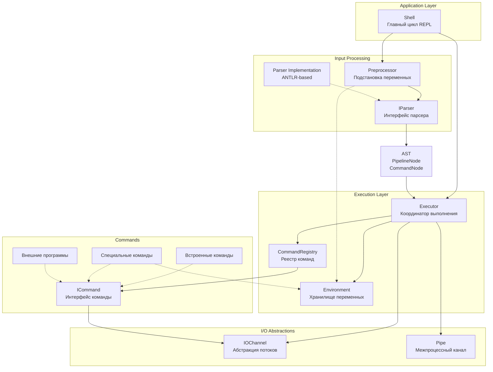
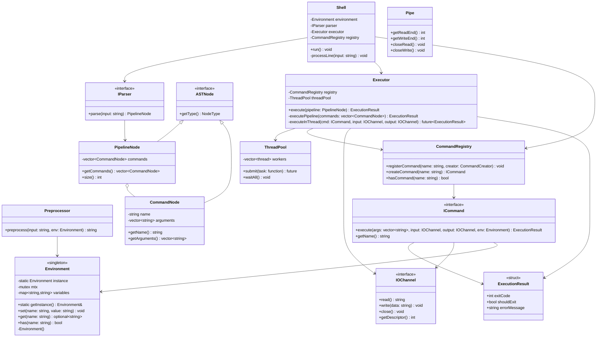
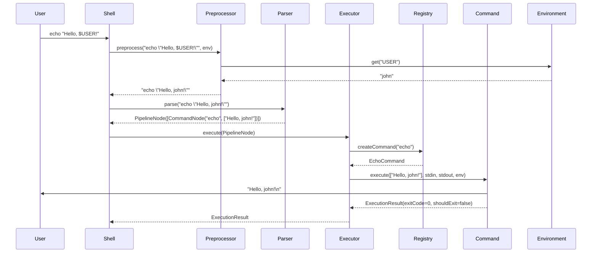
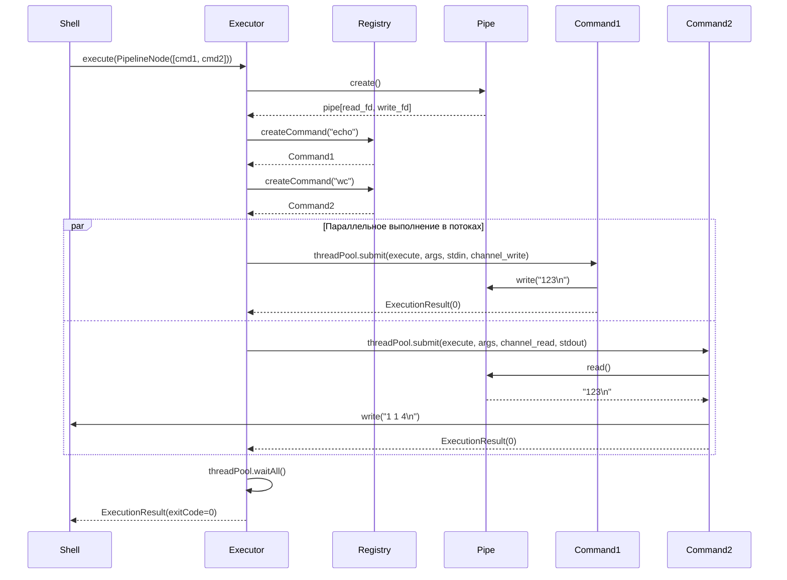

## Архитектурная документация интерпретатора командной строки

### 1. Введение и общее описание

Система представляет собой интерпретатор командной строки, который обеспечивает интерактивное выполнение команд в цикле REPL (Read-Eval-Print-Loop). Интерпретатор поддерживает встроенные команды, управление переменными окружения, конвейерную обработку данных и запуск внешних программ.

**Ключевые архитектурные принципы:**
- Четкое разделение ответственности между компонентами
- Расширяемость через паттерн Command и Registry
- Иммутабельность AST после построения
- Явное управление потоками ввода-вывода через абстракции
- Унификация выполнения: команда = конвейер из одного элемента

---

### 2. Функциональные требования

#### 2.1 Встроенные команды

- **`cat [file]`** — вывод содержимого файла или данных из входного потока
- **`echo [args...]`** — вывод текстовых аргументов
- **`wc [file]`** — подсчет строк, слов и байтов
- **`pwd`** — отображение текущей рабочей директории
- **`exit [code]`** — завершение работы интерпретатора

#### 2.2 Управление данными

- **Одинарные кавычки** `'...'` (full quoting) — полное экранирование, подстановка переменных НЕ выполняется
- **Двойные кавычки** `"..."` (weak quoting) — экранирование с сохранением подстановки переменных
- **Переменные окружения** — установка через синтаксис `name=value`
- **Подстановка переменных** — использование оператора `$` для доступа к значениям

#### 2.3 Расширенная функциональность

- **Конвейеры (pipelines)** — связывание команд через оператор `|`
- **Внешние программы** — автоматический вызов системных утилит
- **Множественное присваивание** — `x=1 y=2 command` устанавливает переменные перед выполнением

---

### 3. Общая архитектура системы



#### Описание слоев:

**Application Layer** — управляет главным циклом программы, читает пользовательский ввод и координирует работу компонентов.

**Input Processing** — преобразует текстовую строку в структурированное представление:
- **Preprocessor** — выполняет подстановку переменных с учетом контекста кавычек ДО парсинга
- **IParser** — интерфейс парсера, скрывающий детали реализации
- **Parser Implementation** — конкретная реализация

**Execution Layer** — создает объекты команд и организует их выполнение:
- **Executor** — координатор выполнения конвейеров
- **Environment** — хранилище переменных окружения
- **CommandRegistry** — реестр команд

**I/O Abstractions** — управление потоками ввода-вывода для команд и конвейеров.

---

### 4. Детальная диаграмма классов



---

### 5. Детали архитектуры

#### 5.1 Представление команд и конвейеров

**Унификация выполнения:**
- Любая команда представляется как `PipelineNode`, содержащий один или несколько `CommandNode`
- Одиночная команда = конвейер из одного элемента
- Это упрощает архитектуру и устраняет дублирование логики

**CommandNode:**
- Содержит имя команды и список аргументов
- Присваивание переменных представляется как `CommandNode` с именем `__assign__` и аргументами в формате `name=value`
- Это обеспечивает единообразие обработки всех операций

**Пример представления:**
```
echo hello          → PipelineNode([CommandNode("echo", ["hello"])])
cat file | wc       → PipelineNode([CommandNode("cat", ["file"]), CommandNode("wc", [])])
x=10                → PipelineNode([CommandNode("__assign__", ["x=10"])])
x=1 y=2 echo $x     → PipelineNode([CommandNode("__assign__", ["x=1", "y=2"]), CommandNode("echo", ["$x"])])
```

---

#### 5.2 Создание команд (CommandRegistry)

**Паттерн Registry:**
- `CommandRegistry` хранит отображение `имя → команда`
- При запросе команды отдается экземпляр команды
- Если команда не зарегистрирована, создается `ExternalCommand`

**Расширяемость:**
Для добавления новой команды:
1. Реализовать интерфейс `ICommand`
2. Зарегистрировать команду в `CommandRegistry` с функцией-создателем
3. Никаких изменений в других компонентах не требуется

**Типы команд:**
- **Встроенные** (cat, echo, wc, pwd, exit) — реализованы внутри интерпретатора
- **Специальные** (\_\_assign\_\_) — внутренние команды для управления окружением
- **Внешние** — системные программы

---

#### 5.3 Исполнение команд и конвейеров

**Executor:**
- Принимает `PipelineNode` и выполняет все команды в нем
- Для конвейера из N команд создает N-1 IOChannel
- Встроенные команды запускаются в отдельных потоках через ThreadPool
- Внешние команды запускаются в отдельных процессах (fork/exec)
- Ожидает завершения всех потоков/процессов и возвращает результат

**Управление потоками данных:**
- Каждая команда получает два канала: `input` и `output`
- Для первой команды: input = stdin
- Для последней команды: output = stdout
- Для промежуточных: input/output = соответствующие IOChannel
- IOChannel работает как producer-consumer: один поток пишет, другой читает
- Потокобезопасность обеспечивается внутри IOChannel

**Коды возврата:**
- Код возврата конвейера = код возврата последней команды
- Если любая команда завершилась с ошибкой, это фиксируется, но конвейер продолжает работу
- Специальный флаг `shouldExit` в `ExecutionResult` сигнализирует о необходимости завершения интерпретатора

---


#### 5.4 Парсинг входной строки

**Двухэтапный процесс:**

**Этап 1: Препроцессинг (Preprocessor)**
- Выполняется ДО парсинга
- Сканирует строку посимвольно, отслеживая контекст кавычек и переменные из окружения
- Заменяет `$VAR` на значения из `Environment`
- Правила подстановки:
  - Вне кавычек → подстановка
  - В двойных кавычках `"..."` → подстановка (weak quoting)
  - В одинарных кавычках `'...'` → БЕЗ подстановки (full quoting)

**Этап 2: Парсинг (IParser)**
- Принимает обработанную строку
- Возвращает `PipelineNode` с деревом команд
- Детали реализации скрыты за интерфейсом

---

#### 5.5 Хранение и модификация окружения

**Environment (Singleton):**
- Глобальное хранилище пар `имя → значение`
- Реализован как Singleton для обеспечения единственного экземпляра
- Предоставляет методы `set()`, `get()`, `has()`
- Доступен всем компонентам через `Environment::getInstance()`

**Потокобезопасность:**
- Все операции с Environment защищены мьютексом
- `set()` и `get()` выполняются атомарно
- Это критично для многопоточного выполнения команд

**Модификация:**
- Присваивание `x=value` обрабатывается как специальная команда `__assign__`
- Команда `__assign__` вызывает `Environment::getInstance().set(name, value)`
- Переменные доступны сразу после установки во всех потоках

**Область видимости:**
- Переменные существуют в рамках сессии интерпретатора
- Доступны всем потокам через Singleton
- Для передачи в внешние программы требуется явная поддержка

---

#### 5.6 Завершение работы по exit

**Механизм:**
- Команда `exit` устанавливает флаг `shouldExit = true` в `ExecutionResult`
- `Shell` проверяет этот флаг после каждого выполнения
- При `shouldExit == true` главный цикл REPL завершается

**Код возврата:**
- `exit` может принимать опциональный аргумент — код возврата
- Этот код передается в `ExecutionResult.exitCode`
- Интерпретатор завершается с указанным кодом

---

### 6. Диаграмма последовательности: выполнение команды



---

### 7. Диаграмма последовательности: выполнение конвейера



---
