# Architecture Documentation

## Overview

This document describes the architecture of the Better Than Fluffy Tribble shell implementation, focusing on component interactions and data flow. The system is built around a pipeline execution model where commands run in parallel threads, communicating through thread-safe channels. The architecture emphasizes separation of concerns with distinct layers for parsing, execution, and I/O operations.

## System Architecture

The shell follows a layered architecture where user input flows through several transformation stages before execution. The [`ShellRepl`](../include/shell_repl.h:15) acts as the main orchestrator, coordinating between the parsing layer (Preprocessor and Parser) and the execution layer (Executor and Commands). The [`CommandsRegistry`](../include/executor/commands/registry.h:9) serves as a central repository for command implementations, while the Channel system provides thread-safe communication between pipeline stages.

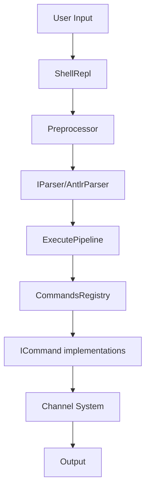

## Component Interactions

### 1. Main Execution Flow

The main execution flow demonstrates how a user command travels through the system from input to output. When a user enters a command, [`ShellRepl`](../include/shell_repl.h:15) first passes it to the Preprocessor for variable expansion and quote handling. The processed string then goes to the [`IParser`](../include/parser/iparser.h:30) implementation (AntlrParser), which uses ANTLR to parse the grammar and produce a [`PipelineNode`](../include/common.h:28) containing [`CommandNode`](../include/common.h:9) objects. Finally, the [`ExecutePipeline`](../include/executor/executor.h:7) function creates threads for each command and manages their execution through channels.

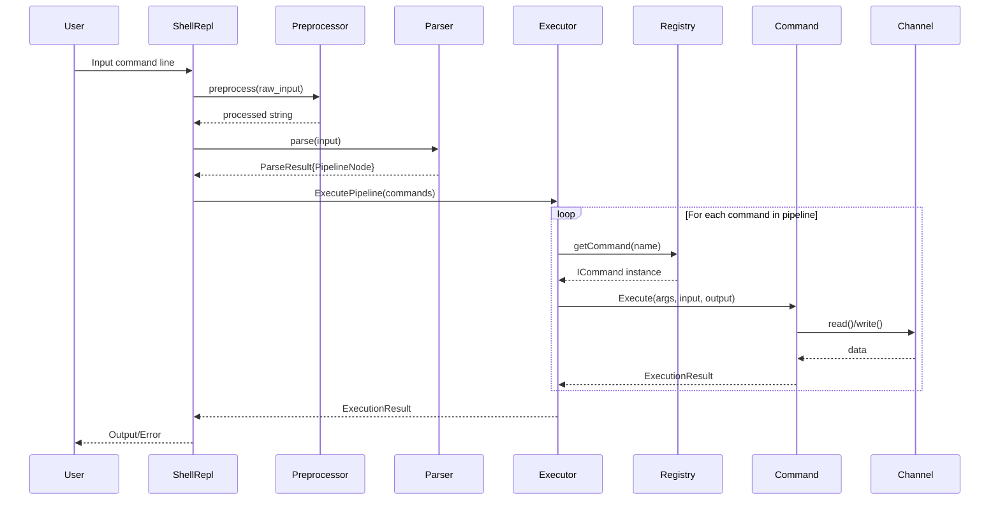

### 2. Pipeline Execution with Threading

Pipeline execution leverages C++ threading to run commands in parallel. The [`ExecutePipeline`](../src/executor/executor.cpp:47) function creates a shared [`PipelineState`](../src/executor/executor.cpp:12) object that coordinates all threads using atomic variables. Each command runs in its own thread via the [`SingleNodeExecution`](../src/executor/executor.cpp:19) function. Threads communicate through [`Channel`](../include/executor/channel.h:44) objects that implement both input and output interfaces. If any command fails or requests exit, it sets the `should_stop` flag in the shared state, causing other threads to terminate gracefully. This design allows for true parallel execution while maintaining proper error propagation.

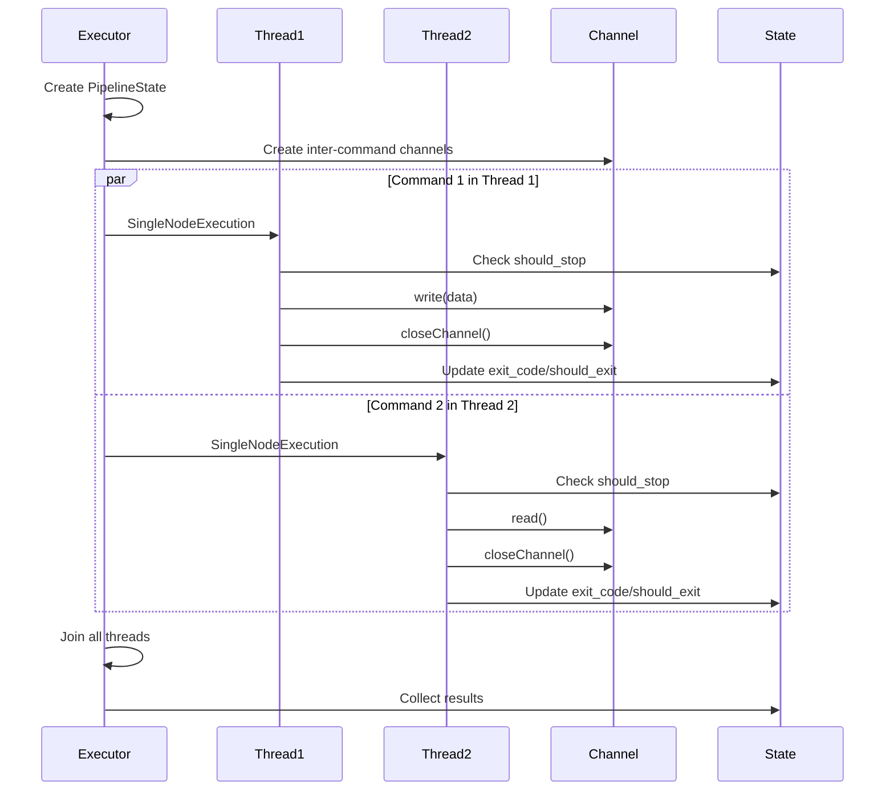

### 3. Channel Communication Pattern

The channel system enables thread-safe data transfer between commands in a pipeline. A single [`Channel`](../include/executor/channel.h:44) object implements both [`IInputChannel`](../include/executor/channel.h:16) and [`IOutputChannel`](../include/executor/channel.h:24) interfaces, allowing it to serve as the connection point between two commands. The first command writes to the output interface while the second command reads from the input interface of the same underlying channel. This design ensures that data flows correctly through the pipeline while maintaining thread safety through mutex protection. Special channel types [`InputStdChannel`](../include/executor/channel.h:31) and [`OutputStdChannel`](../include/executor/channel.h:38) handle standard input/output at the pipeline boundaries.

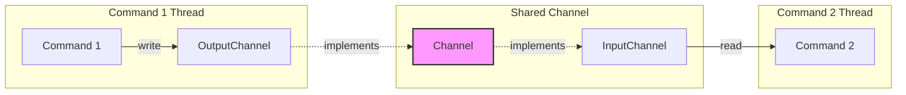

### 4. Command Registry Pattern

The [`CommandsRegistry`](../include/executor/commands/registry.h:9) implements the singleton pattern to provide centralized command management. Built-in commands like [`EchoCommand`](../include/executor/commands/echo.h:1), [`CatCommand`](../include/executor/commands/cat.h:1), and [`PwdCommand`](../include/executor/commands/pwd.h:1) are registered at startup using the `registerCommand` template method. When the executor needs a command, it calls `getCommand(name)` which returns the registered implementation or falls back to [`ExternalCommand`](../include/executor/commands/external.h:1) for system commands. This pattern allows easy extension with new commands without modifying the executor code, and ensures command instances are properly managed throughout the application lifecycle.

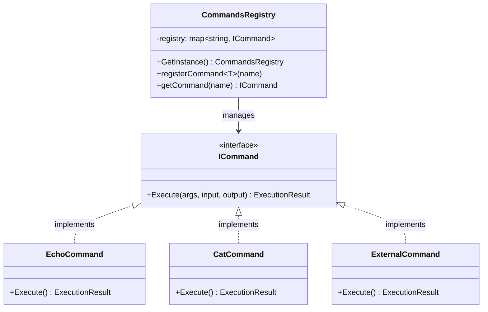

### 5. Channel Hierarchy

The channel system uses interface inheritance to provide flexibility in I/O handling. The base [`IChannel`](../include/executor/channel.h:10) interface defines the `closeChannel()` operation common to all channels. [`IInputChannel`](../include/executor/channel.h:16) extends this with `read()` and `isClosed()` methods, while [`IOutputChannel`](../include/executor/channel.h:24) adds the `write()` method. The concrete [`Channel`](../include/executor/channel.h:44) class implements both interfaces, using a mutex-protected stringstream buffer and condition variable for thread-safe blocking I/O. The specialized [`InputStdChannel`](../include/executor/channel.h:31) and [`OutputStdChannel`](../include/executor/channel.h:38) classes handle standard streams, allowing the pipeline to seamlessly integrate with terminal I/O.

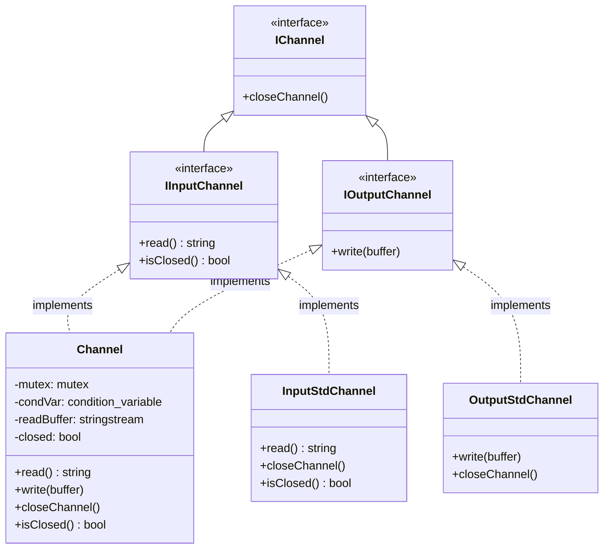

### 6. Parser Integration

The parsing layer transforms raw text input into structured command representations. The Preprocessor handles variable substitution and quote processing before parsing begins. The [`AntlrParser`](../include/parser/antlr_parser.h:1) implementation uses the ANTLR4 runtime library with the [`Shell.g4`](../grammar/Shell.g4:1) grammar file to perform lexical and syntactic analysis. The parser produces a [`ParseResult`](../include/parser/iparser.h:9) containing either a [`PipelineNode`](../include/common.h:28) with the parsed command structure or an error message. This separation allows the grammar to be modified independently of the execution logic, and the [`IParser`](../include/parser/iparser.h:30) interface enables alternative parser implementations if needed.

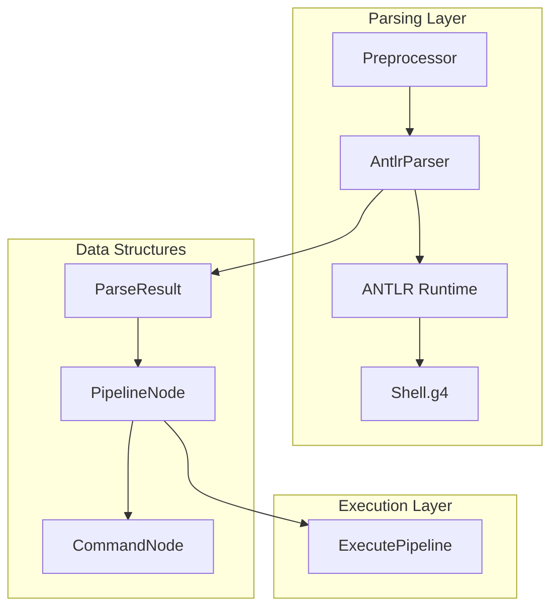

## Key Interaction Patterns

### Thread Synchronization

Thread synchronization in the executor relies on the shared [`PipelineState`](../src/executor/executor.cpp:12) object. This structure contains atomic boolean flags (`should_stop`, `should_exit`) and an atomic integer (`exit_code`) that allow threads to coordinate without explicit locking for reads. When a command completes, it checks if it should update the shared state using compare-and-exchange operations to ensure only the first error is recorded. Other threads periodically check the `should_stop` flag and terminate early if set. After all threads complete, the main thread collects the final state and returns it as an [`ExecutionResult`](../include/common.h:57). This design minimizes lock contention while ensuring proper error propagation across the pipeline.

The executor creates one thread per command in the pipeline:

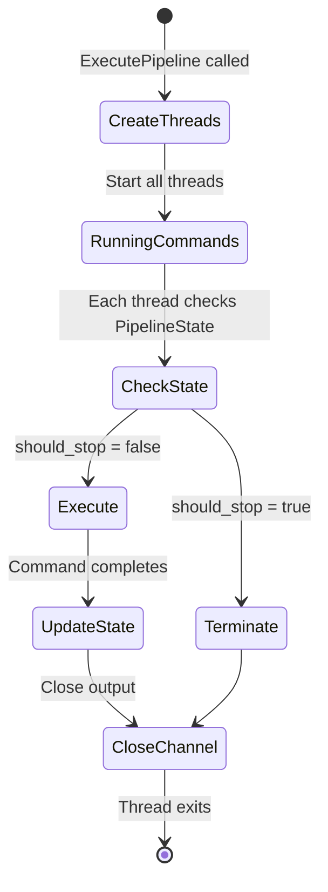

### Channel Blocking Behavior

The [`Channel`](../include/executor/channel.h:44) class implements producer-consumer semantics with blocking operations. When a writer thread calls `write()`, the data is appended to an internal stringstream buffer protected by a mutex, and a condition variable notifies waiting readers. When a reader thread calls `read()`, it acquires the mutex and checks if data is available. If the buffer is empty and the channel is not closed, the reader blocks on the condition variable until data arrives or the channel closes. Once the writer calls `closeChannel()`, subsequent reads return empty strings and `isClosed()` returns true, allowing the reader to detect end-of-stream. This blocking behavior ensures proper synchronization without busy-waiting, and the mutex protection guarantees thread-safe access to the shared buffer.

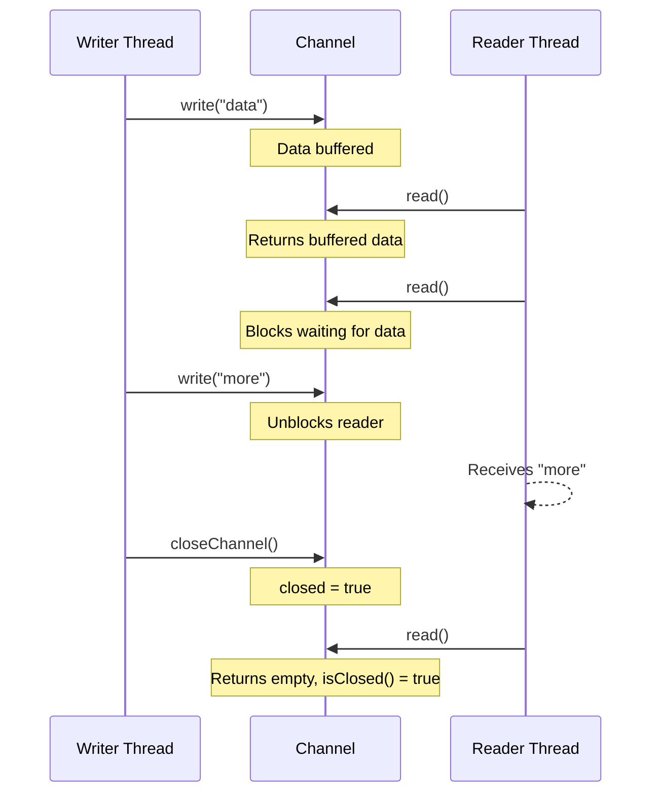

### Error Propagation

Error propagation in the pipeline uses the shared [`PipelineState`](../src/executor/executor.cpp:12) to coordinate failure handling across threads. When a command's [`Execute`](../include/executor/commands/icommand.h:15) method returns an [`ExecutionResult`](../include/common.h:57) with a non-zero exit code or `should_exit` flag set, the thread attempts to update the shared state using atomic compare-and-exchange. Only the first thread to encounter an error successfully sets the `should_stop` flag, preventing race conditions. Other threads check this flag before and during execution, allowing them to terminate early without performing unnecessary work. This design ensures that pipeline execution stops promptly on error while preserving the exit code and exit request from the failing command. The main thread collects these values after joining all threads and returns them to the REPL.

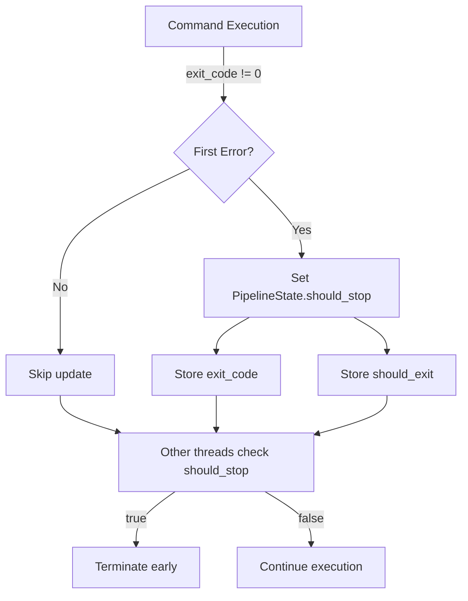

## Component Responsibilities

### ShellRepl

The [`ShellRepl`](../include/shell_repl.h:15) class serves as the main entry point and orchestrator for the shell. It owns instances of the Preprocessor and [`IParser`](../include/parser/iparser.h:30), managing their lifecycle and coordinating their use. The `run()` method implements the read-eval-print loop, reading user input, calling `process_line()` to execute it, and displaying results or errors. The `process_line()` method chains preprocessing, parsing, and execution, handling errors at each stage and returning an [`ExecutionResult`](../include/common.h:57). This centralized control flow makes it easy to add features like command history or multi-line input support.

- **Interactions**: Owns Parser and Preprocessor, calls Executor
- **Data Flow**: User input → Preprocessor → Parser → Executor → User output

### Preprocessor

The Preprocessor handles text transformations before parsing. It expands environment variables (e.g., `$HOME` → `/home/user`), processes escape sequences, and manages quote handling. The preprocessor operates independently of the parser, making it easy to modify preprocessing rules without affecting grammar definitions. Its `preprocess()` method takes a raw input string and returns a processed string ready for parsing.

- **Interactions**: Standalone, called by ShellRepl
- **Data Flow**: Raw string → Variable expansion → Processed string

### Parser (AntlrParser)

The [`AntlrParser`](../include/parser/antlr_parser.h:1) implements the [`IParser`](../include/parser/iparser.h:30) interface using ANTLR4 for grammar-based parsing. It loads the [`Shell.g4`](../grammar/Shell.g4:1) grammar, creates a lexer and parser, and walks the parse tree to build a [`PipelineNode`](../include/common.h:28) structure. The parser handles syntax errors gracefully, returning a [`ParseResult`](../include/parser/iparser.h:9) with an error message rather than throwing exceptions. This design isolates parsing complexity and allows the grammar to evolve independently of the execution engine.

- **Interactions**: Uses ANTLR runtime, produces PipelineNode
- **Data Flow**: String → ANTLR parsing → AST → PipelineNode

### Executor

The [`ExecutePipeline`](../src/executor/executor.cpp:47) function is the core of the execution engine. It creates a thread for each command in the pipeline, sets up [`Channel`](../include/executor/channel.h:44) objects to connect them, and manages the shared [`PipelineState`](../src/executor/executor.cpp:12) for coordination. The executor handles both the first command (reading from stdin) and the last command (writing to stdout) specially, using [`InputStdChannel`](../include/executor/channel.h:31) and [`OutputStdChannel`](../include/executor/channel.h:38) respectively. After starting all threads, it waits for them to complete and collects the final execution result.

- **Interactions**: Creates threads, manages channels, queries Registry
- **Data Flow**: PipelineNode → Thread creation → Channel setup → Command execution

### CommandsRegistry

The [`CommandsRegistry`](../include/executor/commands/registry.h:9) singleton manages the mapping from command names to [`ICommand`](../include/executor/commands/icommand.h:12) implementations. It provides a `registerCommand<T>()` template method that uses the command's static `createCommand()` factory method to instantiate and store commands. The `getCommand()` method looks up commands by name, returning an [`ExternalCommand`](../include/executor/commands/external.h:1) instance for unknown commands to handle system executables. This centralized registry makes it easy to add new built-in commands without modifying the executor.

- **Interactions**: Singleton accessed by Executor, stores ICommand instances
- **Data Flow**: Command name → Registry lookup → ICommand instance

### ICommand Implementations

Each command class implements the [`ICommand`](../include/executor/commands/icommand.h:12) interface, providing an `Execute()` method that takes arguments and input/output channels. Commands read from their input channel, perform their operation, and write results to their output channel. Built-in commands like [`EchoCommand`](../include/executor/commands/echo.h:1), [`CatCommand`](../include/executor/commands/cat.h:1), and [`WcCommand`](../include/executor/commands/wc.h:1) implement specific shell functionality, while [`ExternalCommand`](../include/executor/commands/external.h:1) uses `fork()` and `exec()` to run system programs. All commands return an [`ExecutionResult`](../include/common.h:57) indicating success or failure.

- **Interactions**: Execute with input/output channels
- **Data Flow**: Input channel → Command logic → Output channel

### Channel System

The channel system provides thread-safe communication between pipeline stages. The [`Channel`](../include/executor/channel.h:44) class uses a mutex-protected stringstream buffer and condition variable to implement blocking read/write operations. Writers append data and notify readers via the condition variable, while readers block until data is available or the channel closes. The [`IInputChannel`](../include/executor/channel.h:16) and [`IOutputChannel`](../include/executor/channel.h:24) interfaces allow channels to be used polymorphically, and the special [`InputStdChannel`](../include/executor/channel.h:31) and [`OutputStdChannel`](../include/executor/channel.h:38) classes integrate with standard streams.

- **Interactions**: Thread-safe communication between commands
- **Data Flow**: Writer thread → Mutex-protected buffer → Reader thread

## Threading Model

The shell uses a thread-per-command model for pipeline execution. When [`ExecutePipeline`](../src/executor/executor.cpp:47) is called, it creates one `std::thread` for each command in the pipeline, passing each thread the [`SingleNodeExecution`](../src/executor/executor.cpp:19) function with appropriate input/output channels. All threads start simultaneously, allowing true parallel execution. The shared [`PipelineState`](../src/executor/executor.cpp:12) coordinates threads using atomic variables, avoiding the need for heavy locking. After starting all threads, the main thread calls `join()` on each one to wait for completion. This model maximizes parallelism while keeping the implementation straightforward, and the channel system handles all inter-thread communication safely.

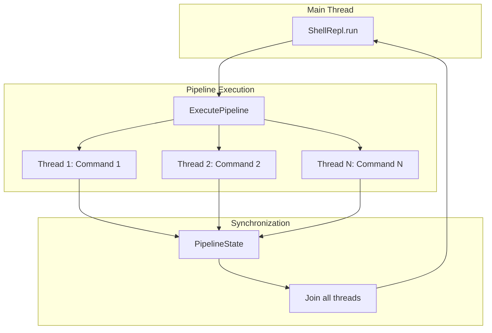

## Data Structures

### Core Types

The system uses several key data structures to represent commands and execution state. [`CommandNode`](../include/common.h:9) encapsulates a single command with its name and arguments. [`PipelineNode`](../include/common.h:28) contains a vector of CommandNodes representing a complete pipeline. [`ExecutionResult`](../include/common.h:57) carries the exit code, exit flag, and error message from command execution. [`ParseResult`](../include/parser/iparser.h:9) wraps either a successful PipelineNode or an error message from parsing. These structures provide clean interfaces between components and make the data flow through the system explicit and type-safe.

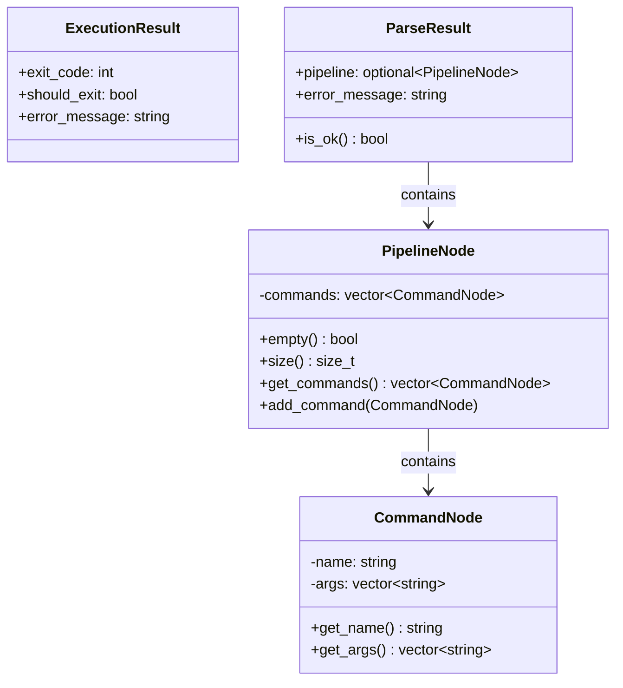

## Summary

The Better Than Fluffy Tribble shell architecture demonstrates several important design patterns and principles that work together to create a robust, extensible command-line shell:

1. **Separation of Concerns**: Parsing, execution, and I/O are separate layers
2. **Interface-Based Design**: IParser, ICommand, IChannel enable extensibility
3. **Thread-Per-Command**: Each command runs in its own thread for true parallelism
4. **Channel-Based Communication**: Thread-safe channels connect pipeline stages
5. **Registry Pattern**: Centralized command registration and lookup
6. **Shared State**: PipelineState coordinates thread execution and error handling
